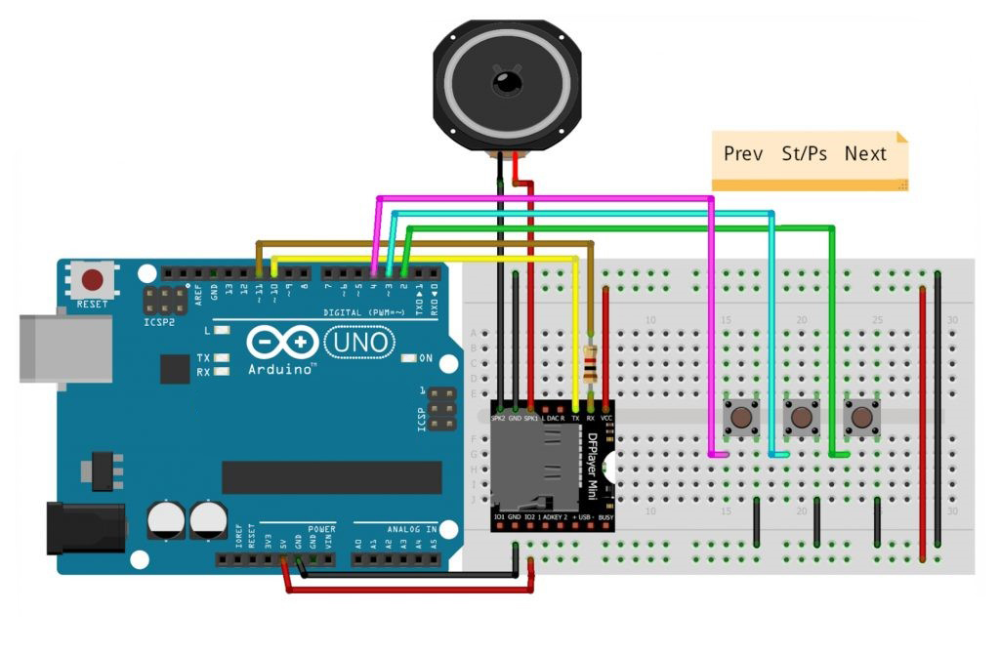

# MP3 Player based on Arduino Uno

## Description:

- DFplayer mini is a simple audio output mp3 module that can be connected directly to a speaker or earphone jack. The module can be used in combination with Arduino, which allows for RX / TX (Serial) communication, so that through simple serial commands we can play music and perform other functions such as playing the next and previous song, shuffle, pause the song being played, etc. This module is equipped with an SDcard slot and supports FAT16, FAT32 file systems.

## Component (Tools & Materials):

- Arduino Uno = 1 unit;
- Breadboard / Project Board = 1 unit;
- DFPlayer Mini = 1 unit;
- Speaker = 1 unit;
- Pushbutton = 3 unit;
- Resistor 1kΩ = 1 unit.

## Circuit Schematic:



## Wiring Information

- Pin on Arduino :
  - Pin 2 – Button Next
  - Pin 3 – Button Start/Pause
  - Pin 4 – Button Previous
  - Pin 10 – Pin TX DFPlayer
  - Pin 11 – Res 1k – Pin RX DFPlayer

## Skecth Program:

```cpp
/* MP3Player Based On Arduino Uno*/

#include "SoftwareSerial.h"  //Pendeklarasian Library
SoftwareSerial mySerial(10, 11);

# define Start_Byte 0x7E
# define Version_Byte 0xFF
# define Command_Length 0x06
# define End_Byte 0xEF
# define Acknowledge 0x00
# define ACTIVATED LOW

int buttonNext = 2;
int buttonPause = 3;
int buttonPrevious = 4;
boolean isPlaying = false;

void setup () {
    pinMode(buttonPause, INPUT);
    digitalWrite(buttonPause, HIGH);
    pinMode(buttonNext, INPUT);
    digitalWrite(buttonNext, HIGH);
    pinMode(buttonPrevious, INPUT);
    digitalWrite(buttonPrevious, HIGH);
    mySerial.begin (9600);
    delay(1000);
    playFirst();
    isPlaying = true;
}

void loop () {
    if (digitalRead(buttonPause) == ACTIVATED) {
        if (isPlaying) {
        pause();
        isPlaying = false;
        }
        else {
        isPlaying = true;
        play();
        }
    }

    if (digitalRead(buttonNext) == ACTIVATED) {
        if (isPlaying) {
        playNext();
        }
    }

    if (digitalRead(buttonPrevious) == ACTIVATED) {
        if (isPlaying) {
        playPrevious();
        }
    }
}

void playFirst() { //Deklarasi Musik Pertama
    execute_CMD(0x3F, 0, 0);
    delay(500);
    setVolume(20);
    delay(500);
    execute_CMD(0x11, 0, 1);
    delay(500);
}

void pause() {  //Deklarasi Pause
    execute_CMD(0x0E, 0, 0);
    delay(500);
    }

void play() {  //Deklarasi Play
    execute_CMD(0x0D, 0, 1);
    delay(500);
}

void playNext() {  //Deklarasi Next
    execute_CMD(0x01, 0, 1);
    delay(500);
}

void playPrevious() {  //Deklarasi Previous
    execute_CMD(0x02, 0, 1);
    delay(500);
}

void setVolume(int volume) {  //Deklarasi Volume
    execute_CMD(0x06, 0, volume); // Seting volume antara (0x00~0x30)
    delay(2000);
}

void execute_CMD(byte CMD, byte Par1, byte Par2) {
    word checksum = -(Version_Byte + Command_Length + CMD + Acknowledge + Par1 + Par2);
    byte Command_line[10] = { Start_Byte, Version_Byte, Command_Length, CMD, Acknowledge,
                                Par1, Par2, highByte(checksum), lowByte(checksum), End_Byte
                            };
    for (byte k = 0; k < 10; k++)  {
        mySerial.write( Command_line[k]);
    }
}
```

## Conclusion :

- In this project, DFPlayer is used as a module to be used as an mp3 player. The first button from the right is used as the Next button, then the middle button functions as the play/pause button and the third button is used as the Previous button.
